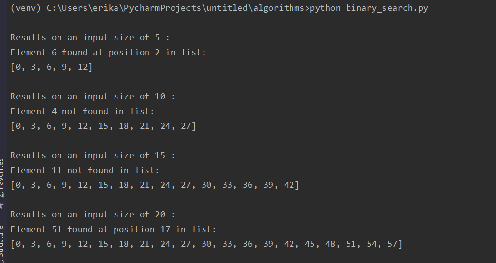
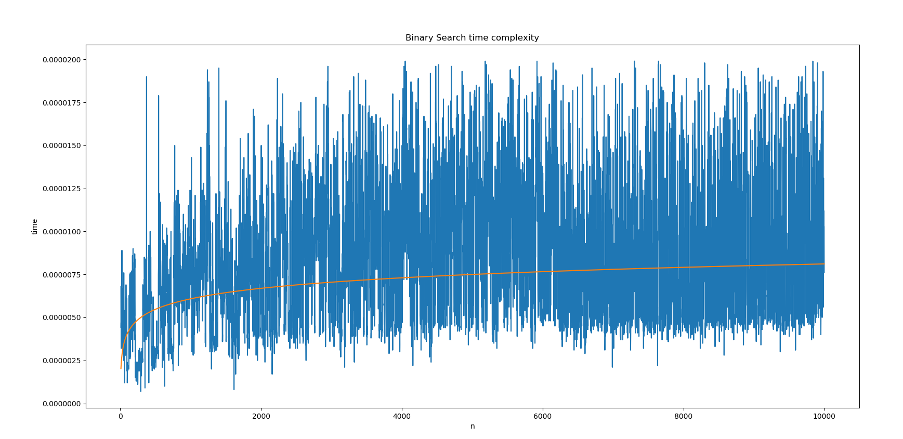

# Binary Search in Python

This is a recursive implementation of binary search in python with some profiling data taken. 

Use the command "python binarySeach.py" to run the program

To collect profiling data I used the timeit function from the timer library and plt() from matplotlib to plot my timing data. The expected time complexity is O(log n)

